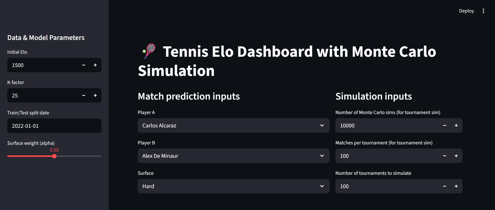

# 🎾 Tennis Match Outcome Modeling with Elo & Monte Carlo 

  
  
  
  

Probabilistic modeling pipeline for tennis match outcomes using an Elo rating framework with surface-specific adjustments and Monte Carlo simulation. The project focuses on calibrated probability estimates, uncertainty analysis, and transparent evaluation.

---

## Visual overview

  

*Streamlit dashboard for exploring Elo-based match probabilities, Monte Carlo convergence, and tournament simulations.*

---

## Overview

- Player skill is represented as a latent Elo rating learned sequentially from historical match data.
- Both global and surface-specific ratings (Hard, Clay, Grass) are maintained to capture surface-dependent performance.
- Match win probabilities are computed using the standard Elo logistic function with a tunable surface-blending parameter.
- Monte Carlo simulation is used to analyze sampling variability and outcome dispersion across repeated matches and tournaments.
- Model performance is evaluated on a held-out test set using proper scoring rules and calibration diagnostics.

---
## Dataset

Source: [URL](https://github.com/JeffSackmann/tennis_atp.git)

---
## Assumptions

- Match outcomes are modeled as independent Bernoulli trials conditional on the predicted win probability.
- Player strength is summarized by a single scalar Elo rating per context.
- A fixed K-factor is applied uniformly across players, surfaces, and time.
- Surface effects are modeled via separate Elo processes rather than explicit match-level covariates.
- Monte Carlo results reflect sampling variability given fixed probabilities, not uncertainty in Elo parameter estimates.

These assumptions prioritize interpretability, reproducibility, and analytical clarity.

---

## Extensions

Potential extensions include:

- Time-decay or recent-form weighting
- Bayesian Elo formulations to represent rating uncertainty
- Explicit treatment of match format (best-of-3 vs best-of-5)
- Integration of contextual factors such as injuries, rest, or head-to-head effects

---

## Disclaimer

All outputs produced by this project are **probabilistic simulations**, not deterministic predictions.  
The model is intended for analytical and exploratory purposes.  
Built as a personal data science project exploring **sports analytics and probabilistic modeling**.
